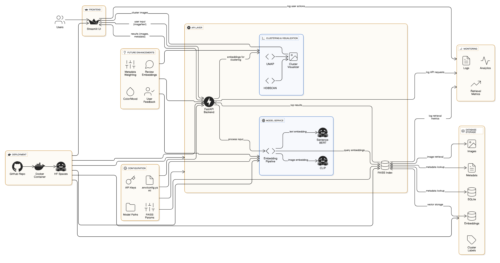

# VibeCheck: Multimodal Restaurant Discovery Through Ambience Intelligence

[](https://www.python.org/)
[](https://streamlit.io/)
[](LICENSE)
[](https://python-poetry.org/)

## Overview

Link to db image files: https://drive.google.com/drive/folders/1EXlgII9BrqfkYYuDljkOHK8dXKCDldb6?usp=sharing

(add images of the final thing here)

VibeCheck is an advanced multimodal machine learning application that revolutionizes restaurant discovery by prioritizing **ambience and aesthetic experience** over traditional search parameters like cuisine type, price range, or star ratings. By leveraging state-of-the-art deep learning models for cross-modal understanding, VibeCheck enables users to find dining establishments that match their desired atmosphere, whether expressed through natural language descriptions or reference photographs.

The system addresses a fundamental gap in current restaurant recommendation systems: the inability to search based on subjective aesthetic qualities and atmospheric characteristics that significantly influence dining experiences but are difficult to capture through conventional metadata.

### Core Value Proposition

- **Ambience-First Discovery**: Search restaurants by their visual and atmospheric characteristics rather than categorical filters
- **Cross-Modal Intelligence**: Seamlessly translate between text descriptions and visual representations of dining environments
- **Semantic Understanding**: Capture nuanced aesthetic qualities like "cozy romantic lighting," "industrial minimalist," or "vintage bohemian charm"
- **Visual Similarity Matching**: Upload reference images to discover venues with comparable aesthetic qualities
- **Intelligent Clustering**: Automatically group restaurants by shared atmospheric characteristics for exploratory discovery

## Technical Architecture

### System Components




### Technology Stack

#### Machine Learning & AI
- **CLIP (Contrastive Language-Image Pretraining)**: OpenAI's multimodal model for generating aligned embeddings of images and text in a shared semantic space
- **Sentence-BERT**: Advanced sentence embedding model for enhanced natural language understanding and semantic similarity
- **FAISS (Facebook AI Similarity Search)**: High-performance library for efficient similarity search and clustering of dense vectors at scale
- **UMAP (Uniform Manifold Approximation and Projection)**: Dimensionality reduction algorithm for visualizing high-dimensional embedding spaces
- **HDBSCAN (Hierarchical Density-Based Spatial Clustering)**: Density-based clustering algorithm for discovering natural groupings in data

#### Application Framework
(add frontend framework)
- **Poetry**: Modern Python dependency management and packaging system
- **Python 3.8+**: Core programming language and runtime environment

#### ML Operations & Monitoring
- **MLFlow**: Experiment tracking and model registry for reproducible ML workflows
- **DVC (Data Version Control)**: Version control system for data and ML pipelines
- **Evidently**: ML monitoring and data quality validation framework

## Methodology

### 1. Multimodal Embedding Generation

The system employs a dual-encoder architecture to create semantically meaningful representations of both restaurant images and textual descriptions:

**Image Encoding Pipeline:**
- Images are processed through CLIP's vision transformer (ViT) encoder
- Visual features are extracted capturing compositional, lighting, color palette, and spatial arrangements
- Output: 512-dimensional dense vector representation

**Text Encoding Pipeline:**
- Natural language descriptions are tokenized and embedded using CLIP's text encoder
- Sentence-BERT provides additional semantic enrichment for complex queries
- Output: 512-dimensional dense vector in the same semantic space as images

**Key Insight**: CLIP's contrastive learning ensures that semantically similar concepts (e.g., "warm lighting" and an image of candlelit ambiance) are positioned close together in the embedding space, enabling effective cross-modal retrieval.

### 2. Vector Similarity Search

The system utilizes FAISS for efficient nearest-neighbor search across potentially millions of restaurant embeddings:

**Index Architecture:**
- **IndexFlatL2**: Exhaustive L2 (Euclidean) distance search for maximum accuracy
- **IndexIVFFlat**: Inverted file index with quantization for production-scale deployments
- **GPU Acceleration**: Optional CUDA-enabled acceleration for high-throughput scenarios

**Search Process:**
1. Query (text or image) is encoded into the shared embedding space
2. FAISS computes similarity scores (inverse L2 distance or cosine similarity) against all indexed restaurants
3. Top-K most similar venues are retrieved with relevance scores
4. Results are ranked and filtered based on semantic similarity thresholds

**Performance Characteristics:**
- Search latency: <50ms for 1M vectors (GPU) or <200ms (CPU)
- Memory footprint: ~4GB for 1M 512-dimensional vectors
- Scalability: Supports billion-scale datasets with appropriate indexing

### 3. Dimensionality Reduction & Visualization

**UMAP Implementation:**
- Reduces 512-dimensional embeddings to 2D/3D for human-interpretable visualization
- Preserves both local and global structure of the embedding space
- Hyperparameters optimized for clustering tasks:
  - `n_neighbors=30`: Balances local and global structure preservation
  - `min_dist=0.0`: Enables tight cluster formation for clearer separation
  - `metric='euclidean'`: Distance metric matching FAISS similarity computation

**HDBSCAN Clustering:**
- Density-based clustering without requiring pre-specified cluster count
- Automatically identifies restaurants with shared atmospheric characteristics
- Handles noise and outliers gracefully through probabilistic assignment
- Parameters:
  - `min_cluster_size`: Minimum number of restaurants to form a distinct vibe cluster
  - `min_samples`: Determines robustness to noise in the data

**Use Cases:**
- Visual exploration of restaurant landscape organized by ambience
- Discovery of "hidden" aesthetic categories not captured by traditional taxonomies
- Quality assessment of embedding space structure

### 4. Query Mechanisms

**Text-Based Search:**
```python
query = "cozy vintage cafe with warm lighting and rustic wooden furniture"
# System encodes query → Searches embedding space → Returns top matches
```

**Image-Based Search:**
```python
reference_image = "user_uploaded_restaurant_photo.jpg"
# System encodes image → Finds visually similar venues → Returns results
```

**Hybrid Search:**
- Combine text constraints with image similarity
- Example: "Like this photo, but with outdoor seating"


## Installation & Setup

### Prerequisites

- **Python**: Version 3.8 or higher
- **Poetry**: For dependency management (install via `pip install poetry`)
- **Hardware Recommendations**:
  - Minimum: 8GB RAM, modern CPU
  - Recommended: 16GB RAM, CUDA-capable GPU for faster processing
  - Storage: 2-5GB for models and indexes

### Installation Steps

1. **Clone the Repository**
```bash
git clone https://github.com/manav-ar/VibeCheck.git
cd VibeCheck
```

2. **Install Dependencies via Poetry**
```bash
poetry install
```

This will create a virtual environment and install all required packages including:
- torch (PyTorch for deep learning)
- transformers (Hugging Face model hub)
- sentence-transformers (Sentence-BERT)
- faiss-cpu or faiss-gpu (vector search)
- streamlit (web application)
- umap-learn (dimensionality reduction)
- hdbscan (clustering)
- pillow (image processing)
- numpy, pandas (data manipulation)
- plotly (interactive visualizations)
- mlflow (experiment tracking)
- dvc (data version control)
- evidently (ML monitoring)

3. **Verify Installation**
```bash
poetry run python -c "import torch; import sentence_transformers; import faiss; print('Installation successful!')"
```

### Platform-Specific Configuration

#### macOS Users (Important)
The application includes special environment variable configurations to prevent segmentation faults with CLIP and PyTorch on macOS:

```bash
# These are automatically set by the launch script
export OMP_NUM_THREADS=1
export MKL_NUM_THREADS=1
```

**Always use the provided launch command:**
```bash
poetry run vibecheck-app
```

**Do NOT run:** `streamlit run vibecheck_app.py` directly on macOS

#### Linux Users
Standard execution works without special configuration:
```bash
poetry run vibecheck-app
# OR
poetry run streamlit run vibecheck_app.py
```

#### Windows Users
Standard execution:
```bash
poetry run vibecheck-app
```

For GPU acceleration (NVIDIA CUDA required):
```bash
# Install GPU version of FAISS
poetry add faiss-gpu
```

## Usage Guide

### Quick Start

1. **Launch the Application**
```bash
poetry run vibecheck-app
```

2. **Access the Interface**
- Application opens automatically at `http://localhost:8501`
- Streamlit interface loads with search options

### Search Workflows (needs to be updated after frontend is finalised)

#### Workflow 1: Text-Based Ambience Search

1. Navigate to the "Text Search" tab
2. Enter a detailed description of your desired atmosphere:
   ```
   Example: "Romantic Italian restaurant with dim warm lighting,
   candlelit tables, exposed brick walls, and vintage wine bottles"
   ```
3. Click "Search"
4. Browse results ranked by semantic similarity
5. View similarity scores and restaurant details

#### Workflow 2: Image-Based Discovery

1. Navigate to the "Image Search" tab
2. Upload a reference image (JPEG, PNG formats supported)
   - Personal restaurant photos
   - Screenshots from social media
   - Magazine or blog images
3. Optionally add text refinements
4. Click "Find Similar Venues"
5. Explore visually similar restaurants

#### Workflow 3: Exploratory Clustering

1. Navigate to the "Explore Clusters" tab
2. View the 2D UMAP projection of all restaurants
3. Observe automatically discovered ambience clusters
4. Click on clusters to view constituent restaurants
5. Identify emerging aesthetic trends

### Best Practices for Search Queries

**Effective Text Queries:**
- Be specific about lighting, materials, and spatial qualities
- Include sensory descriptors (warm, intimate, airy, bustling)
- Reference specific design styles (mid-century modern, art deco, Scandinavian)
- Describe atmosphere, not food type

**Example Quality Queries:**
```
✓ "Bright airy space with floor-to-ceiling windows, white walls, and minimalist furniture"
✓ "Cozy neighborhood bistro with mismatched vintage furniture and string lights"
✓ "Upscale modern steakhouse with dark leather booths and dramatic lighting"

✗ "Good Italian restaurant" (too vague, cuisine-focused)
✗ "Nice place" (lacks specific ambience descriptors)
```

**Image Upload Tips:**
- Use well-lit, clear images showing interior design
- Avoid images with excessive people or food close-ups
- Multiple angles provide more comprehensive representation
- Higher resolution images (>800px) work better

## Project Structure

```
VibeCheck/
├── vibecheck_app.py              # Main Streamlit application entry point
├── scripts/
│   └── run_streamlit.py          # macOS-compatible launch script
├── models/
│   ├── clip_encoder.py           # CLIP model wrapper and utilities
│   ├── sentence_bert_encoder.py  # Sentence-BERT integration
│   └── embedding_fusion.py       # Multimodal embedding fusion strategies
├── indexing/
│   ├── faiss_indexer.py          # FAISS index construction and management
│   ├── vector_store.py           # Persistent vector storage
│   └── similarity_search.py      # Search query execution
├── clustering/
│   ├── umap_projector.py         # UMAP dimensionality reduction
│   ├── hdbscan_clusterer.py      # HDBSCAN clustering implementation
│   └── visualization.py          # Interactive plotting utilities
├── data/
│   ├── restaurants.json          # Restaurant metadata
│   ├── embeddings/               # Pre-computed embedding vectors
│   └── images/                   # Restaurant image dataset
├── utils/
│   ├── preprocessing.py          # Image and text preprocessing
│   ├── config.py                 # Configuration management
│   └── logger.py                 # Logging utilities
├── tests/
│   ├── test_encoders.py          # Unit tests for embedding models
│   ├── test_search.py            # Integration tests for search
│   └── test_clustering.py        # Clustering validation tests
├── notebooks/
│   ├── exploratory_analysis.ipynb    # Data exploration
│   └── embedding_quality.ipynb       # Embedding space analysis
├── pyproject.toml                # Poetry dependency specification
├── poetry.lock                   # Locked dependency versions
├── README.md                     # This file
├── LICENSE                       # MIT License
└── .gitignore                    # Git ignore patterns
```


## ML Operations & Experiment Tracking

VibeCheck includes MLFlow for experiment tracking, DVC for data versioning, and Evidently for model monitoring.

### MLFlow: Experiment Tracking

#### Quick Start

```bash
# Initialize and start MLFlow server
poetry run python scripts/init_mlflow.py
mlflow ui --port 5000

# Or use Docker (production)
docker-compose -f docker-compose.mlflow.yml up -d

# Access at http://localhost:5000
```

#### Tracked Experiments

**Embedding Generation** (`vibecheck-embeddings`)
- Parameters: Model names, dimensions, device
- Metrics: Success rate, image coverage, embedding statistics

**Vibe Mapping** (`vibecheck-vibe-mapping`)
- Parameters: UMAP (n_neighbors, min_dist), HDBSCAN (min_cluster_size)
- Metrics: Cluster count, noise points, cluster statistics

#### Usage Example

```python
from vibecheck.embeddings import EmbeddingGenerator
from vibecheck.mlflow_config import init_mlflow

init_mlflow()
generator = EmbeddingGenerator(use_mlflow=True)
embeddings, ids = generator.generate_all(run_name="experiment_v1")
```

### DVC: Data Version Control

#### Setup and Track Data

```bash
# Track large files
dvc add data/images/sample_images
dvc add data/embeddings/vibe_embeddings.npy

# Commit to git
git add data/**/*.dvc .dvc/
git commit -m "Track data with DVC"

# Push to remote storage (optional)
dvc remote add -d myremote s3://my-bucket/dvc-storage
dvc push
```

#### Run Pipeline

```bash
# Execute full pipeline
dvc repro

# View pipeline
dvc dag

# Check metrics
dvc metrics show

# Experiment with parameters
vim params.yaml  # Modify parameters
dvc repro        # Rerun pipeline
dvc metrics diff # Compare results
```

The pipeline ([dvc.yaml](dvc.yaml)) automatically:
1. Generates embeddings from restaurant data
2. Creates vibe map with UMAP + HDBSCAN

### Evidently: Model Monitoring

#### Generate Reports

```bash
# Create monitoring dashboard
poetry run python scripts/generate_monitoring_report.py

# Reports saved to monitoring/reports/ (HTML)
```

#### Usage in Code

```python
from vibecheck.monitoring import EvidentlyMonitor

monitor = EvidentlyMonitor()

# Detect embedding drift
report_path = monitor.create_embedding_drift_report(
    reference_embeddings=baseline_embeddings,
    current_embeddings=new_embeddings,
    reference_ids=baseline_ids,
    current_ids=new_ids
)
```

Evidently monitors:
- Embedding distribution drift
- Data quality issues
- Recommendation quality metrics

### ML Ops Workflow

**Development:**
1. Initialize MLFlow: `poetry run python scripts/init_mlflow.py`
2. Run experiments with tracking enabled
3. Compare results in MLFlow UI
4. Track data with DVC: `dvc add data/`

**Production:**
1. Use Docker Compose for MLFlow server
2. Configure remote storage for DVC
3. Run pipeline: `dvc repro`
4. Generate monitoring reports regularly

## Testing (to be updated when tests are implemented)

### Running Tests

```bash
# Run all tests
poetry run pytest

# Run specific test modules
poetry run pytest tests/test_encoders.py
poetry run pytest tests/test_search.py

# Run with coverage report
poetry run pytest --cov=. --cov-report=html
```

### Test Coverage

- **Unit Tests**: Individual component functionality (encoders, search, clustering)
- **Integration Tests**: End-to-end search workflows
- **Performance Tests**: Latency and throughput benchmarks
- **Embedding Quality Tests**: Semantic similarity validation

## Deployment (to be updated upon deployment)

### Local Deployment

Standard Streamlit deployment:
```bash
poetry run vibecheck-app
```

### Docker Deployment

```dockerfile
FROM python:3.9-slim

WORKDIR /app
COPY . /app

RUN pip install poetry
RUN poetry install --no-dev

EXPOSE 8501

CMD ["poetry", "run", "vibecheck-app"]
```

Build and run:
```bash
docker build -t vibecheck:latest .
docker run -p 8501:8501 vibecheck:latest
```


## Limitations & Future Work

### Current Limitations

1. **Data Dependency**: Requires high-quality restaurant images and descriptions
2. **Computational Cost**: CLIP inference can be resource-intensive for large-scale deployments
3. **Language Support**: Currently optimized for English text queries
4. **Temporal Dynamics**: Does not account for time-of-day lighting variations
5. **Subjective Ambience**: Personal aesthetic preferences may vary significantly

### Future Enhancements

**Short-Term:**
- [ ] Support for additional languages (multilingual CLIP)
- [ ] Mobile-optimized interface
- [ ] User feedback integration for personalized results
- [ ] Expanded restaurant database integration (Yelp, Google Places APIs)

**Mid-Term:**
- [ ] Fine-tuned CLIP model on restaurant-specific data
- [ ] Temporal modeling (day vs. night ambience)
- [ ] Audio ambience analysis (background music, noise level)
- [ ] 3D spatial layout understanding

**Long-Term:**
- [ ] Generative ambience synthesis (create novel restaurant concepts)
- [ ] Augmented reality preview (visualize restaurant ambience)
- [ ] Personalized aesthetic preference learning
- [ ] Multi-stakeholder recommendation (group dining consensus)


## Acknowledgments

### Key Technologies
- **OpenAI CLIP**: For pioneering multimodal contrastive learning
- **Sentence-Transformers**: For state-of-the-art sentence embeddings
- **Facebook AI Research**: For the FAISS library enabling efficient similarity search
- **UMAP Development Team**: For robust dimensionality reduction
- **HDBSCAN Authors**: For advanced density-based clustering


---
